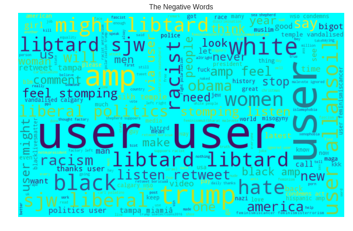
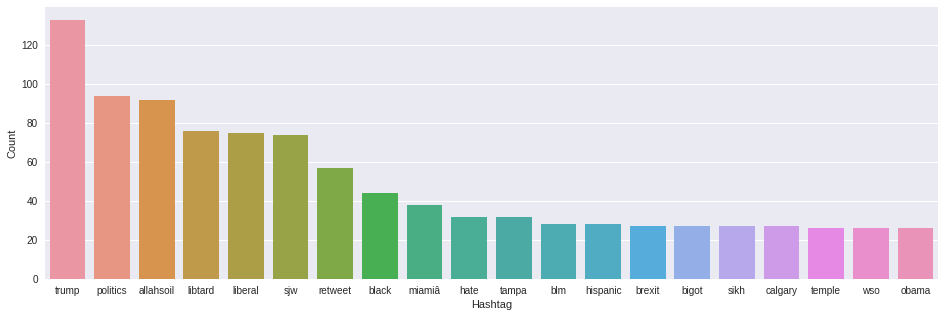
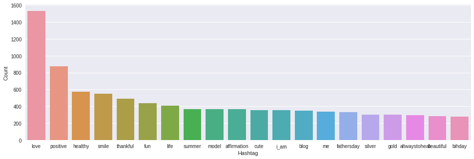
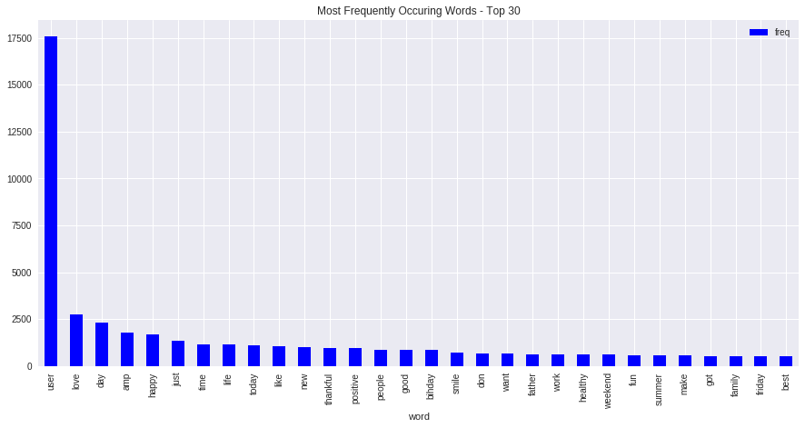

## Research Findings: Visualizing Narrative Clusters

A key part of this project was identifying the linguistic markers of "contested" communication. By comparing positive and negative clusters, we can see how digital narratives diverge.

### 1. Negative Sentiment & Political Polarization
The analysis shows a high concentration of political keywords and controversial terms within negative-labeled data. Terms like "politics," "trump," and "liberal" appearing in the negative WordCloud reflect the "contested" nature of social media narratives.

### 2. Comparison of Narrative Hashtags
By extracting hashtags, we can contrast "Community/Wellness" narratives with "Political/Contested" narratives.
*   **Contested/Negative Hashtags:** Focus on political figures and ideologies (e.g., #trump, #politics, #liberal).
*   **Positive/Regular Hashtags:** Focus on social connection and wellness (e.g., #love, #positive, #healthy).

| Contested Narratives | Positive Narratives |
| :--- | :--- |
|  |  |

### 3. General Vocabulary Distribution
This visualization shows the most frequent linguistic markers across the entire dataset.

